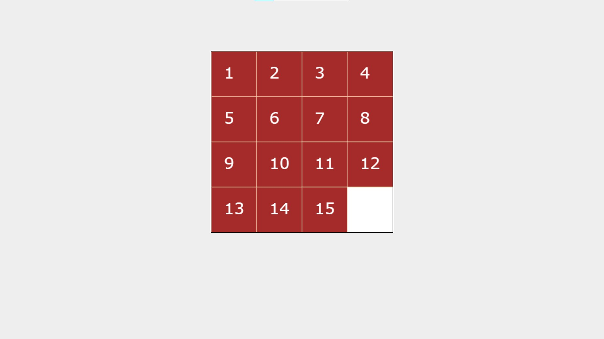

<h1>15-puzzle</h1>
 
Simple 15-puzzle game written in vanilla js
 
<h2>demo:</h2>
 

 

 
<h2>controls:</h2>
Arrows ←↑→↓.
 
<strong>WARNING:</strong> The tiles around the empty cell are controlled, not the empty cell itself, which may look confusing for some people.